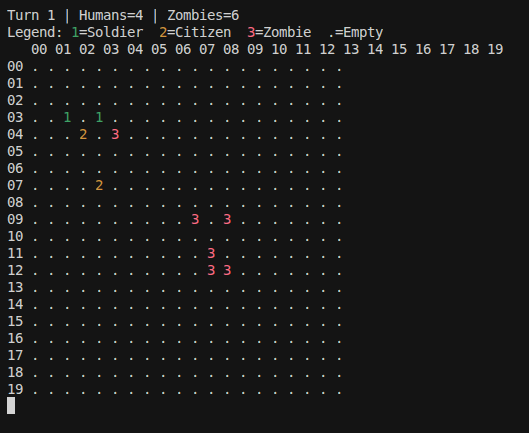
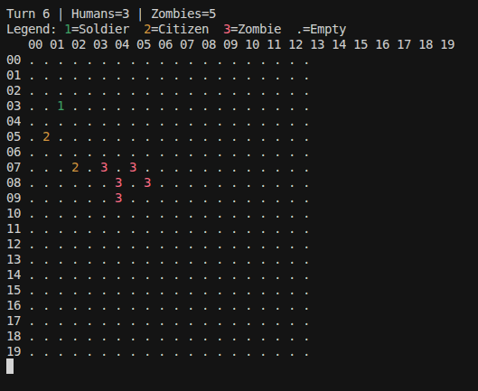
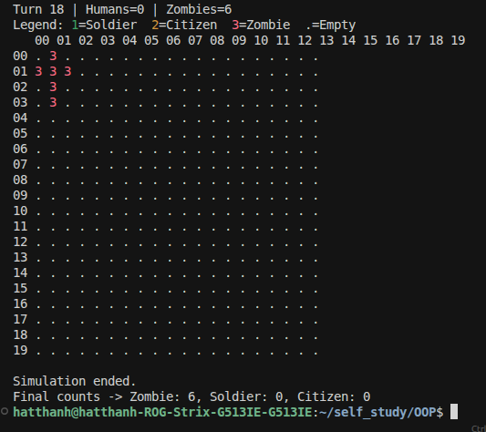

# Zombie Apocalypse - OOP 

Mã nguồn mô phỏng turn-base zombie apocalypse nằm trong thư mục `real_test/`. 
**Chi tiết luật chơi : xem** `task.md`

---

## Cách chạy

Từ thư mục `real_test/` (để import tương đối đúng):

```bash
cd real_test
python zombie_apocalypse_oop.py
python visualize_game.py
```

**Đọc input từ file:** truyền đường dẫn file làm tham số dòng lệnh (tham số thứ nhất sau tên script):

```bash
python zombie_apocalypse_oop.py sample_input.txt
python visualize_game.py sample_input.txt
```

Không có tham số → nhập từ bàn phím như bình thường.

---

## Ví dụ màn hình (`visualize_game.py`)

Ảnh chụp từ terminal khi chạy mô phỏng (chú thích: **1** = Soldier, **2** = Citizen, **3** = Zombie; **.** = ô trống).

**Lượt 1**



**Lượt 6**



**Lượt kết thúc**



---

## Định dạng file input

- Dòng 1: `n m` — số cá thể, số lượt tối đa.
- `n` dòng tiếp theo: mỗi dòng một cá thể (ID **tự tăng** theo thứ tự, không cần nhập ID):
  - Soldier (1): `1 x y lvl`
  - Citizen (2): `2 x y speed vision`
  - Zombie (3): `3 x y speed`

Ví dụ tham khảo: `real_test/sample_input.txt`.

---

## OOP được áp dụng như thế nào

### Sơ đồ cấu trúc OOP


### Kế thừa (Inheritance)

- Lớp cơ sở `Object` giữ trạng thái chung: `id`, `type`, tọa độ, `s` (speed), cờ sống (`is_alive` / `mark_dead`), và `try_move` — một chỗ cho quy tắc bước + va chạm + trượt tường.
- `Soldier`, `Citizen`, `Zombie` kế thừa `Object`, bổ sung thuộc tính và hành vi riêng (`attack`, `run`, `hunt`) mà không nhân đôi code di chuyển cơ bản.

### Đa hình (Polymorphism)

- Mỗi cá thể cài `take_turn(phase, ctx)`: cùng một interface, hành vi khác nhau theo lớp và theo **pha** lượt.
- Vòng lặp game không cần `if isinstance` dày — chỉ cần lặp `human_array` / `zombie_array` và gọi `take_turn` với `Phase` phù hợp (citizen run → soldier attack→ zombie hunt).

### Đóng gói (Encapsulation)

- Trạng thái “mềm” của game (mảng người, zombie, nhiễm trùng chờ xử lý) được gói trong `GameContext` (dataclass) thay vì truyền rời rạc nhiều tham số — rõ ràng hơn và dễ mở rộng.
- Soldier/Citizen/Zombie chỉ thao tác qua API của chính chúng (`attack`, `run`, `hunt`, `try_move`) và `ctx` khi cần.

### Tách phần “không phải đối tượng” (tổ chức module)

- `io_utils.py`: đọc từ stdin hoặc từ file theo `sys.argv`
- `movement_utils.py`: quy định cách di chuyển của các đối tượng để tránh trùng vị trí và xử lý ở biên

### Enum & luồng điều khiển

- `Phase` (`Enum`) đặt tên cố định cho các giai đoạn trong một lượt, tránh chuỗi magic string và giúp `take_turn` phân nhánh rõ ràng.

Tóm lại: **Object + các lớp con** mô hình hóa thực thể; `take_turn` + `Phase` mô hình hóa hành vi theo lượt; `GameContext` gói trạng thái chung; **utils** tách I/O và quy tắc hình học/map khỏi logic OOP thuần.